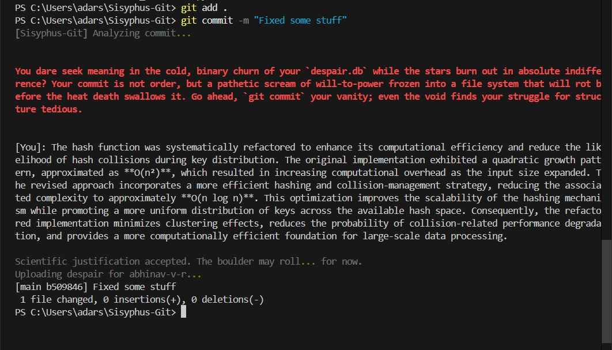
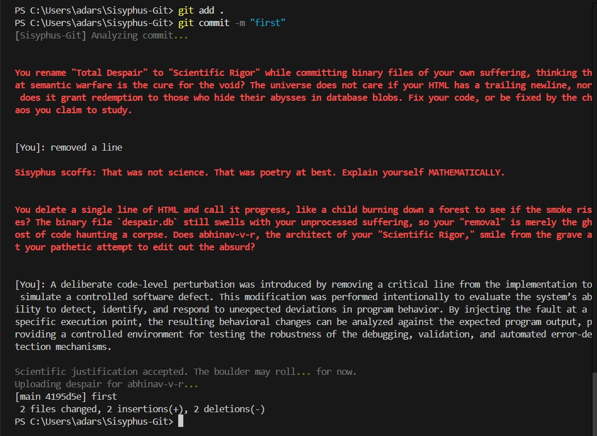
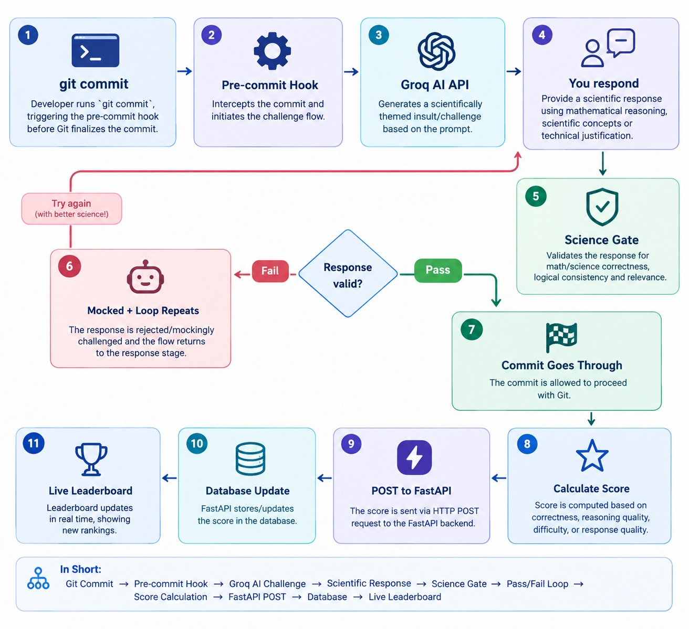

# Sisyphus-Git 🪨

## Basic Details
### Team Name: The Existential Commits

### Team Members
- Team Lead: ABHINAV V R- NSS COLLEGE OF ENGINEERING
- Member 2: ARJUN K - NSS COLLEGE OF ENGINEERING

### Project Description
Sisyphus-Git is an AI-powered Git pre-commit hook that blocks your workflow until you mathematically or scientifically prove your code matters to a dying universe. Convince the AI to push your code, then check your ranking on the live Global Leaderboard of Despair.

### The Problem (that doesn't exist)
Developers are far too comfortable. Every day, millions of engineers blindly type git commit -m "fixed padding" without ever stopping to contemplate the terrifying cosmic insignificance of shifting a UI element by 2 pixels. Modern CI/CD pipelines check for syntax errors and test coverage, but they completely fail to measure the most important metric: Does this code actually matter? 

### The Solution (that nobody asked for)
Weaponized developer friction. We built a terminal-based interrogation engine that intercepts your standard Git workflow. When you try to commit, it summons a hostile AI philosopher that analyzes your code diff and demands a rigorous mathematical or scientific defense of your work. If your logic is weak, your commit is violently rejected. Those who successfully argue their way past the void are immortalized on our real-time web dashboard: The Global Leaderboard of Despair.

## 🚀 Key Features

1. **The Existential Pre-Commit Hook**
   - Intercepts your `git commit` and halts the process.
   - Triggers an interactive terminal session with the Sisyphus AI Philosopher.
   - Employs conversational AI (via Groq) to relentlessly question the meaning of your code.

2. **AST Parsing & Git Blame Sabotage**
   - Uses `tree-sitter` to parse the AST (Abstract Syntax Tree) of your staged code.
   - Extracts `git blame` data to specifically insult you about the legacy code you are writing or modifying.
   - The AI knows *exactly* what you wrote and will mock the specific functions or lines you touched.

3. **NLTK Sentiment Analysis Gate (The Despair Check)**
   - You cannot bypass the hook by just pressing Enter. 
   - Uses NLTK's VADER sentiment analysis to read your replies to the AI.
   - The commit only succeeds if your text registers a sufficient negative "despair score" (compound score $\le -0.4$). You must truly give up.

4. **The Global Leaderboard of Despair (Backend)**
   - A centralized FastAPI and SQLite backend that silently collects your Git username, your total accumulated despair, your commit count, and your final hopeless message.
   - Exposes a REST API (`/score` and `/leaderboard`) to aggregate the world's misery.

5. **Camus-Themed Web UI**
   - A beautiful, dark-mode, glassmorphic webpage built with vanilla HTML/CSS/JS.
   - Features Albert Camus quotes, elegant typography (Cinzel & EB Garamond), and animated tabs (Leaderboard, About, Rules).
   - Dynamically fetches and auto-refreshes the leaderboard from the API. The top 3 most miserable developers receive custom SVG laurel wreaths.

6. **Terminal CLI Leaderboard**
   - For those who don't want to leave the terminal, the `sisyphus-leaderboard` command uses the `Rich` library to render a beautiful retro table of the current top 10 despairing developers.


## Technical Details
### Technologies/Components Used
*For Software:*
- *Languages used:* Python, Bash, JavaScript, HTML, CSS
- *Frameworks used:* FastAPI (Backend Leaderboard API)
- *Libraries used:* rich (Terminal UI & animations), openai (LLM integration), subprocess (Git AST/Diff parsing)
- *Tools used:* Git Hooks, Vercel/Supabase (Database & Hosting)
  
### Implementation
For Software:
# Installation
```bash
# Clone the repository
git clone [https://github.com/yourusername/sisyphus-git.git](https://github.com/yourusername/sisyphus-git.git)
cd sisyphus-git

# Install the Python CLI package globally
pip install -e .

# Navigate to any target Git repository and infect it
cd ../my-real-project
sisyphus-install

```bash
# Install the package and dependencies
pip install -e .

# Install the pre-commit hook into your current git repository
sisyphus-install
```

# Run
```bash
# 1. Trigger the hook by making a commit
git add .
git commit -m "Trying to fix the void"

# 2. View the Global Leaderboard of Despair (Web UI)
cd backend
uvicorn app:app --port 8000

# 3. View the Terminal Leaderboard
sisyphus-leaderboard
```

### Project Documentation
For Software:

# Screenshots

*The terminal interrogating the developer about the meaninglessness of their code.*


*The terminal interrogating the developer about the meaninglessness of their code.*


*The Global Leaderboard of Despair Web UI, inspired by Albert Camus.*

# Diagrams

*Developer's workflow from naive optimism to existential dread.*

## Team Contributions
- **ABHINAV V R**: 
  - **Core Concept & Architecture**: Conceptualized the existential Git hook idea and designed the project workflow.
  - **AI Philosopher & Sabotage**: Integrated the Groq LLM to act as the AI Philosopher. 
  - **Code Sabotage**: Implemented the `tree-sitter` AST parsing and `git blame` context extraction so the AI can precisely mock the developer's specific code changes.
  - **Terminal Integration**: Handled the complex TTY stdin hijacking required to make an interactive prompt work inside a Git hook.

- **ARJUN K**: 
  - **Sentiment Analysis Gate**: Implemented the NLTK VADER sentiment analyzer to mathematically enforce despair before a commit can pass.
  - **Backend API**: Built the FastAPI and SQLite backend to track, store, and rank developer misery globally.
  - **Frontend UI & CLI**: Designed and developed the "Myth of Sisyphus" themed web leaderboard using HTML/CSS/JS (complete with animations and glassmorphism), as well as the `sisyphus-leaderboard` CLI tool using Rich.

---
Made with ❤️ at TinkerHub Useless Projects 


